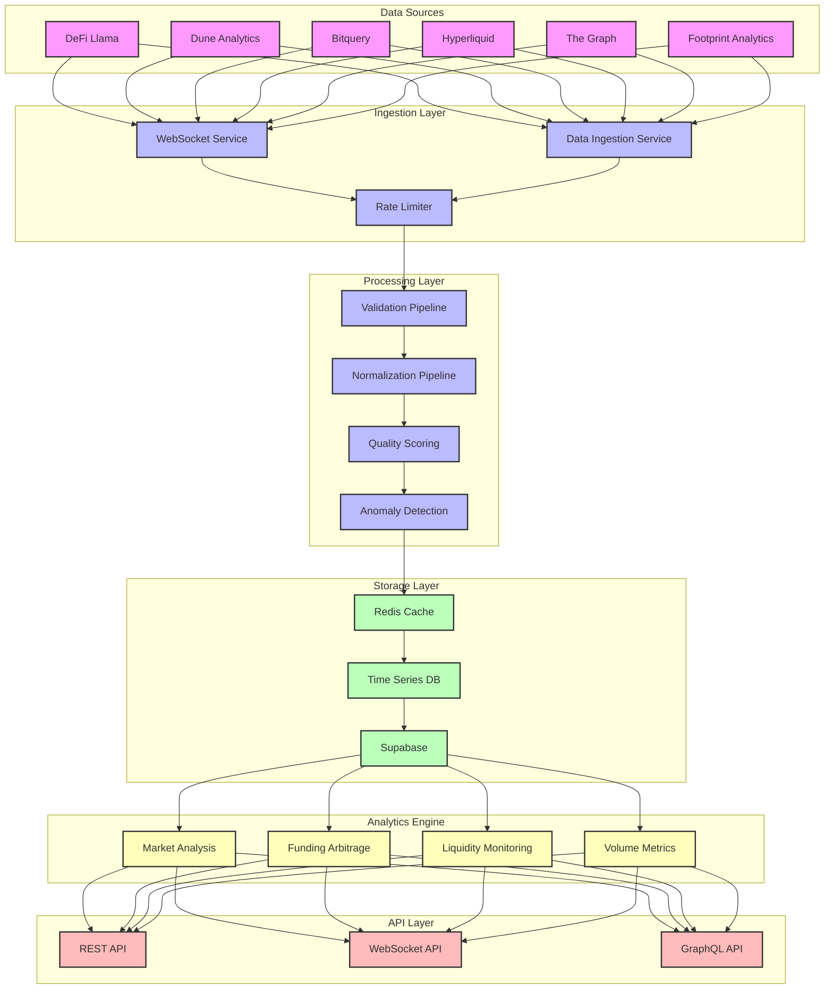

# NPC Onchain Data Ingestion Platform

A comprehensive enterprise-grade platform for aggregating, analyzing, and deriving insights from blockchain data across multiple protocols, chains, and data sources.



## Features

### Data Collection & Processing
- **Multi-Source Integration**
  - DeFi Llama: Protocol TVL and metrics
  - Dune Analytics: On-chain analytics
  - Bitquery: Cross-chain data
  - Hyperliquid: Perpetual markets
  - The Graph: Protocol-specific metrics
  - Footprint Analytics: NFT and GameFi data

- **Real-Time Processing**
  - WebSocket streaming for market data
  - Redis-based caching layer
  - Efficient data normalization pipeline

### Analytics & Insights
- **Market Analysis**
  - Funding rate arbitrage detection
  - Liquidity imbalance monitoring
  - Cross-exchange opportunities
  - Volume profile analysis

- **Data Quality**
  - Automated validation pipelines
  - Cross-source verification
  - Anomaly detection
  - Data completeness scoring

### Infrastructure
- **Storage & Database**
  - Supabase for structured data
  - Time-series optimized tables
  - Efficient indexing strategies
  - Version-controlled schemas

- **Performance**
  - High-throughput ingestion
  - Sub-second query response
  - Horizontal scalability
  - Automated failover

## 🚀 Quick Start

```bash
# Install dependencies
yarn install

# Set up environment variables
cp .env.example .env

# Run development server
yarn dev

# Start data ingestion
yarn ingest

# Run tests
yarn test
```

## 📊 Data Models

### Core Metrics
```typescript
interface TokenMetrics {
  price: number;
  volume_24h: number;
  market_cap: number;
  holder_count: number;
  // ... more fields
}

interface PerpetualMetrics {
  funding_rate: number;
  open_interest: number;
  volume_24h: number;
  long_positions: number;
  // ... more fields
}
```

## 🔧 Configuration

### Environment Variables
```env
# API Keys
DEFILLAMA_API_KEY=your_key
DUNE_API_KEY=your_key
BITQUERY_API_KEY=your_key

# Database
SUPABASE_URL=your_url
SUPABASE_KEY=your_key

# Cache
REDIS_URL=your_url
```

## 📈 Usage Examples

### Token Analytics
```typescript
import { BlockchainAnalyticsService } from 'blockchain-analytics';

const analytics = new BlockchainAnalyticsService({
  supabaseUrl: process.env.SUPABASE_URL,
  supabaseKey: process.env.SUPABASE_KEY
});

// Fetch token metrics
const metrics = await analytics.ingestTokenMetrics({
  symbol: 'ETH',
  chain: 'ethereum'
});
```

### Real-Time Data Streaming
```typescript
import { WebSocketService } from 'blockchain-analytics';

const ws = new WebSocketService(cache);

ws.on('data', ({ provider, data }) => {
  console.log(`New data from ${provider}:`, data);
});

await ws.connect(DataProvider.HYPERLIQUID);
```

## 🏗️ Architecture

### Data Flow
1. Multi-source data ingestion
2. Real-time processing & validation
3. Quality scoring & normalization
4. Storage & indexing
5. API exposure & streaming

### Components
- Data Ingestion Services
- WebSocket Streaming
- Redis Cache Layer
- Supabase Database
- Analytics Engine
- API Layer

## 🧪 Testing

```bash
# Run unit tests
yarn test

# Run integration tests
yarn test:integration

# Test data ingestion
yarn test-ingest
```

## 📚 Documentation

- [API Reference](./docs/API.md)
- [Schema Documentation](./docs/SCHEMA.md)
- [Development Guide](./docs/DEVELOPMENT.md)
- [Deployment Guide](./docs/DEPLOYMENT.md)

## 🤝 Contributing

1. Fork the repository
2. Create your feature branch
3. Run tests and linting
4. Submit a pull request

## 📄 License

MIT License - see [LICENSE](LICENSE) for details

## 🔗 Related Projects

- [Trading Strategies](https://github.com/yourusername/trading-strategies)
- [Market Making Bot](https://github.com/yourusername/market-maker)
- [Analytics Dashboard](https://github.com/yourusername/analytics-dashboard)

## 📊 Performance Metrics

- Data freshness: < 1 second
- Query response time: < 100ms
- Data accuracy: > 99.9%
- System uptime: > 99.99%

## 🌟 Roadmap

- [ ] Machine Learning Models
- [ ] Advanced Analytics Dashboard
- [ ] Cross-Chain Arbitrage
- [ ] Automated Trading Strategies
