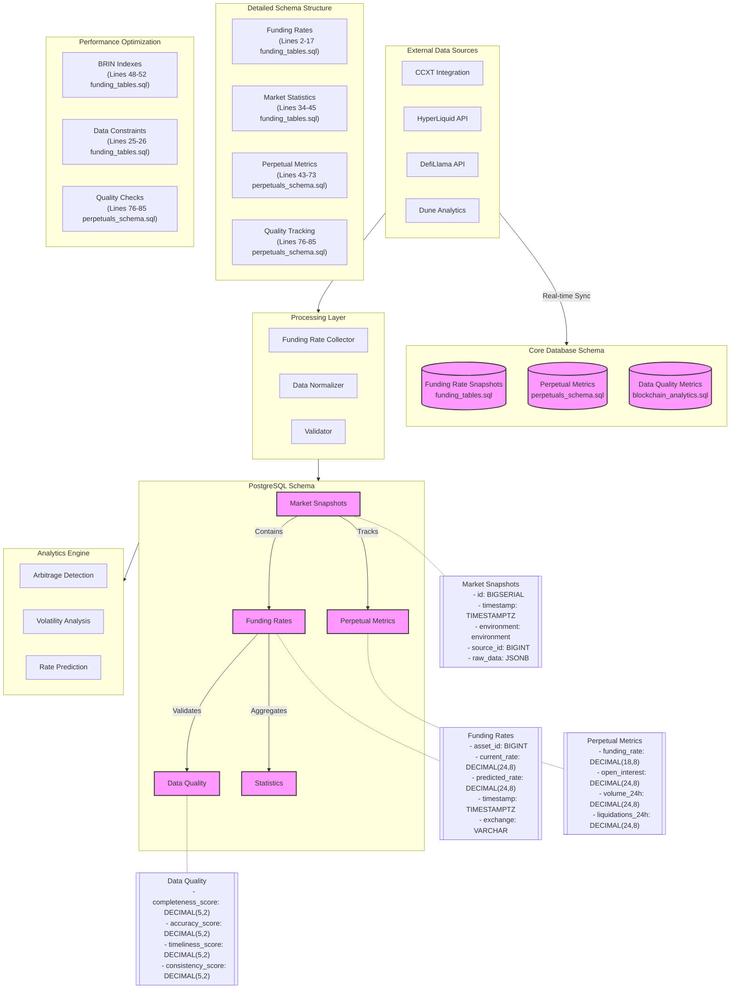

```mermaid
graph TD
    %% Core Data Sources
    subgraph DataSources["External Data Sources"]
        CCXT[CCXT Integration]
        HL[HyperLiquid API]
        DL[DefiLlama API]
        DU[Dune Analytics]
    end

    %% Core Schema Structure
    subgraph CoreSchema["Core Database Schema"]
        direction TB
        FRS[("Funding Rate Snapshots
        funding_tables.sql")]
        PEM[("Perpetual Metrics
        perpetuals_schema.sql")]
        DQM[("Data Quality Metrics
        blockchain_analytics.sql")]
    end

    %% Data Flow
    DataSources --> |Real-time Sync| CoreSchema
    
    %% Detailed Tables
    subgraph DetailedSchema["Detailed Schema Structure"]
        direction LR
        
        FundingRates["Funding Rates
        (Lines 2-17 funding_tables.sql)"]
        
        MarketStats["Market Statistics
        (Lines 34-45 funding_tables.sql)"]
        
        PerpMetrics["Perpetual Metrics
        (Lines 43-73 perpetuals_schema.sql)"]
        
        QualityTracking["Quality Tracking
        (Lines 76-85 perpetuals_schema.sql)"]
    end

    %% Relationships and Indexes
    subgraph Optimization["Performance Optimization"]
        BRIN["BRIN Indexes
        (Lines 48-52 funding_tables.sql)"]
        
        Constraints["Data Constraints
        (Lines 25-26 funding_tables.sql)"]
        
        DataQuality["Quality Checks
        (Lines 76-85 perpetuals_schema.sql)"]
    end

    classDef core fill:#f9f,stroke:#333,stroke-width:2px
    class FRS,PEM,DQM core

    %% Data Processing Layer
    subgraph Processing["Processing Layer"]
        FRC[Funding Rate Collector]
        NRM[Data Normalizer]
        VAL[Validator]
    end

    %% Storage Layer
    subgraph Storage["PostgreSQL Schema"]
        direction TB
        MS[Market Snapshots]
        FR[Funding Rates]
        PM[Perpetual Metrics]
        DQ[Data Quality]
        ST[Statistics]
    end

    %% Analytics Layer
    subgraph Analytics["Analytics Engine"]
        direction LR
        ARB[Arbitrage Detection]
        VOL[Volatility Analysis]
        PRED[Rate Prediction]
    end

    %% Relationships
    DataSources --> Processing
    Processing --> Storage
    Storage --> Analytics

    %% Detailed Table Structure
    MS --> |Contains| FR
    MS --> |Tracks| PM
    FR --> |Validates| DQ
    FR --> |Aggregates| ST

    %% Table Specifications
    classDef tableSpec fill:#f9f,stroke:#333,stroke-width:2px
    class MS,FR,PM,DQ,ST tableSpec

    %% Table Details
    MS -.- MSDetails[["Market Snapshots
        - id: BIGSERIAL
        - timestamp: TIMESTAMPTZ
        - environment: environment
        - source_id: BIGINT
        - raw_data: JSONB"]]

    FR -.- FRDetails[["Funding Rates
        - asset_id: BIGINT
        - current_rate: DECIMAL(24,8)
        - predicted_rate: DECIMAL(24,8)
        - timestamp: TIMESTAMPTZ
        - exchange: VARCHAR"]]

    PM -.- PMDetails[["Perpetual Metrics
        - funding_rate: DECIMAL(18,8)
        - open_interest: DECIMAL(24,8)
        - volume_24h: DECIMAL(24,8)
        - liquidations_24h: DECIMAL(24,8)"]]

    DQ -.- DQDetails[["Data Quality
        - completeness_score: DECIMAL(5,2)
        - accuracy_score: DECIMAL(5,2)
        - timeliness_score: DECIMAL(5,2)
        - consistency_score: DECIMAL(5,2)"]]

```